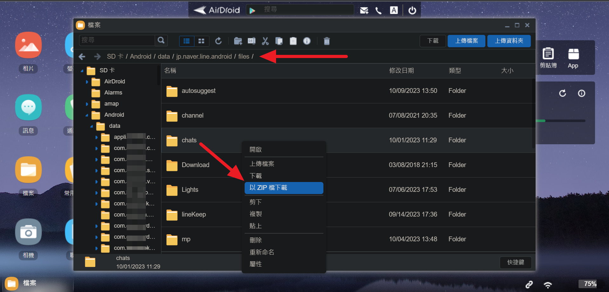
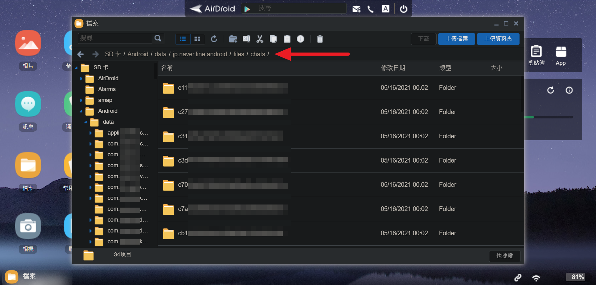

# LINE Chat Backup Helper

Facilitate the process of organizing Android LINE media messages after [backing up them](#back-up-line-chats-data-in-android-app-specific-folder-on-external-storage).


For all LINE chat messages, only text messages can be fully backed up and restored.
Other messages will NOT be fully migrated to LINE on the new phone,
such as images, videos, audios and documents.
Therefore, I organize these media messages, and then save them to my portable storage device.


## Features

-   classify images into `thumbnails`, `images` or `original_images` folders
-   append file extension to file name
-   prefix a meaningful name to chat room folder(ID) after extracting mappings of chat room ID and name provided BY YOU
-   compare chat room list with the older one


## Install

-   Python version >= 3.8

-   clone the repo and enter the folder

-   install python packages

```
pip install pipenv
pipenv install
```


## Usage

```
usage: main.py [-h] [-e {1,2}] -d CHATS_DIR [-l chatroom.csv] [-d0 CHATS_DIR]

LINE Chat Backup Helper
-----------------------------------------------
  * classify images into `thumbnails`, `images` or `original_images` folders
  * append file extension to file name
  * prefix a meaningful name to chat room folder(ID) after extracting mappings of chat room ID and name provided BY YOU
  * compare chat room list with the older one

optional arguments:
  -h, --help            show this help message and exit
  -e {1,2}, --execution {1,2}
                        ONLY (1) extract mappings or (2) prefix name
  -d CHATS_DIR, --chats-dir CHATS_DIR
                        your backup directory path of `/sdcard/Android/data/jp.naver.line.android/files/chats`
  -l chatroom.csv, --chatroom-db chatroom.csv
                        The CSV file saves the mappings of chat room ID and name provided BY YOU.
  -d0 CHATS_DIR, --old-chats-dir CHATS_DIR
                        compare chat rooms in the `--chats-dir` folder with the older one
```


Example
```
# Feature 1 and 2
pipenv run main.py 
    -d "C:\Users\Stella\LINE\Android-data-jp.naver.line.android_20231005_2222\files\chats"

# ONLY extract mappings of chat room ID and name provided BY YOU
pipenv run main.py -e 1 
    -d "C:\Users\Stella\LINE\Android-data-jp.naver.line.android_20231005_2222\files\chats" 
    -l ./chatroom.csv

# ONLY prefix a meaningful name to chat room folder(ID)
pipenv run main.py -e 2 
    -d "C:\Users\Stella\LINE\Android-data-jp.naver.line.android_20231005_2222\files\chats" 
    -l ./chatroom.csv

# Feature 1, 2, 3(ONLY prefix) and 4
pipenv run main.py 
    -d "C:\Users\Stella\LINE\Android-data-jp.naver.line.android_20231005_2222\files\chats" 
    -l ./chatroom.csv 
    -d0 "C:\Users\Stella\LINE\Android-data-jp.naver.line.android_20230914_2137\files\chats"
```


## Input and Output

### Example: Feature 1 and 2

```
# Feature 1 and 2
pipenv run main.py 
    -d "C:\Users\Stella\LINE\Android-data-jp.naver.line.android_20231005_2222\files\chats"
```


Input:
```
|-- C:\Users\Stella\LINE\Android-data-jp.naver.line.android_20231005_2222\files\chats/
    |-- c3337f8e15f2f1d79f69fd2b0575476b6/messages/
        |-- 8552
        |-- 8552.original
        |-- 8552.thumb
        |-- 10000
        |-- 10000.original
        |-- 10000.thumb
        |-- 11111
        |-- 11111.original
        |-- 11111.thumb
        |-- 22222
        |-- 22706.tmp
        |-- 29139.thumb.tmp
        |-- 31674
        |-- 33333
        |-- 44444
        |-- voice_38490.aac
    |-- c7acf23b06ad3e4c029dc5ef6d6e88444/messages/
        |-- 111666
        |-- 111666.thumb
    |-- u111f36cae69bfd641933b23eee717b54/messages/
        |-- voice_11111.aac
```


Output:
```
|-- C:\Users\Stella\LINE\Android-data-jp.naver.line.android_20231005_2222\files\chats/
    |-- c3337f8e15f2f1d79f69fd2b0575476b6/messages/
        |-- images/
            |-- 8552.jpg
            |-- 10000.jpg
            |-- 11111.jpg
        |-- original_images/
            |-- 8552.original.gif
            |-- 10000.original.jpg
            |-- 11111.original.png
        |-- thumbnails/
            |-- 8552.thumb.jpg
            |-- 10000.thumb.jpg
            |-- 11111.thumb.jpg
        |-- 22222               <-- CANNOT guess file type
        |-- 22706.tmp           <-- CANNOT guess file type
        |-- 29139.thumb.tmp.jpg
        |-- 31674.mp4
        |-- 33333.pdf
        |-- 44444.zip
        |-- voice_38490.aac
    |-- c7acf23b06ad3e4c029dc5ef6d6e88444/messages/
        |-- images/
            |-- 111666.jpg
        |-- original_images/
        |-- thumbnails/
            |-- 111666.thumb.jpg
    |-- u111f36cae69bfd641933b23eee717b54/messages/
        |-- images/
        |-- original_images/
        |-- thumbnails/
        |-- voice_11111.aac
```


### Example: Extract mappings of chat room ID and name

```
# ONLY extract mappings of chat room ID and name provided BY YOU
pipenv run main.py -e 1 
    -d "C:\Users\Stella\LINE\Android-data-jp.naver.line.android_20231005_2222\files\chats" 
    -l ./chatroom.csv
```


Prerequisites:
-   Chat room directories are in your backup directory of `/sdcard/Android/data/jp.naver.line.android/files/chats`.

-   You should rename chat room directory as `xxx-ID` or `被退出-xxx-ID`,
    e.g., "家有兩寶-c3337f8e15f2f1d79f69fd2b0575476b6"
    or "被退出-旅行團-c7acf23b06ad3e4c029dc5ef6d6e88444".

-   The ID is generated by LINE and starts with "u", "c" or "r" followed by 32 hex digits.

-   The term "xxx" is provided BY YOU manually and is a meaningful name of the chat room.

-   The term "被退出" is provided BY YOU manually and means that you are exited.
    Default status of chat room is joined.


Input:
```
|-- C:\Users\Stella\LINE\Android-data-jp.naver.line.android_20231005_2222\files\chats/
    |-- 家有兩寶-c3337f8e15f2f1d79f69fd2b0575476b6/
    |-- 被退出-旅行團-c7acf23b06ad3e4c029dc5ef6d6e88444/
    |-- Stella-u111f36cae69bfd641933b23eee717b54/
    |-- u222f36cae69bfd641933b23eee717b54/
```


Output: CSV file
```
"ID","Name","Status"
"c3337f8e15f2f1d79f69fd2b0575476b6","家有兩寶","1"
"c7acf23b06ad3e4c029dc5ef6d6e88444","旅行團","2"
"u111f36cae69bfd641933b23eee717b54","Stella","1"
"u222f36cae69bfd641933b23eee717b54","","1"
```


status of chat room:
-   1: joined, default
-   2: exited


### Example: Prefix a meaningful name to chat room folder(ID)

```
# ONLY prefix a meaningful name to chat room folder(ID)
pipenv run main.py -e 2 
    -d "C:\Users\Stella\LINE\Android-data-jp.naver.line.android_20231005_2222\files\chats" 
    -l ./chatroom.csv
```


Prerequisites: see [Example: Extract mappings of chat room ID and name](#example-extract-mappings-of-chat-room-id-and-name)


Input:
```
|-- C:\Users\Stella\LINE\Android-data-jp.naver.line.android_20231005_2222\files\chats/
    |-- 家有兩寶-c3337f8e15f2f1d79f69fd2b0575476b6/
    |-- 被退出-旅行團-c7acf23b06ad3e4c029dc5ef6d6e88444/
    |-- u111f36cae69bfd641933b23eee717b54/
    |-- u222f36cae69bfd641933b23eee717b54/
    |-- u333f36cae69bfd641933b23eee717b54/
```


Input: CSV file
```
"ID","Name","Status"
"c3337f8e15f2f1d79f69fd2b0575476b6","家有兩寶","1"
"c7acf23b06ad3e4c029dc5ef6d6e88444","旅行團","2"
"u111f36cae69bfd641933b23eee717b54","Stella","1"
"u222f36cae69bfd641933b23eee717b54","","1"
```


Output:
```
|-- C:\Users\Stella\LINE\Android-data-jp.naver.line.android_20231005_2222\files\chats/
    |-- 家有兩寶-c3337f8e15f2f1d79f69fd2b0575476b6/
    |-- 被退出-旅行團-c7acf23b06ad3e4c029dc5ef6d6e88444/
    |-- Stella-u111f36cae69bfd641933b23eee717b54/
    |-- u222f36cae69bfd641933b23eee717b54/
    |-- u333f36cae69bfd641933b23eee717b54/
```


### Example: Feature 1, 2, 3(ONLY prefix) and 4

```
# Feature 1, 2, 3(ONLY prefix) and 4
pipenv run main.py 
    -d "C:\Users\Stella\LINE\Android-data-jp.naver.line.android_20231005_2222\files\chats" 
    -l ./chatroom.csv 
    -d0 "C:\Users\Stella\LINE\Android-data-jp.naver.line.android_20230914_2137\files\chats"
```


Input:
```
|-- C:\Users\Stella\LINE\Android-data-jp.naver.line.android_20231005_2222\files\chats/
    |-- c3337f8e15f2f1d79f69fd2b0575476b6/messages/
        |-- 8552
        |-- 8552.original
        |-- 8552.thumb
        |-- 10000
        |-- 10000.original
        |-- 10000.thumb
        |-- 11111
        |-- 11111.original
        |-- 11111.thumb
        |-- 22222
        |-- 22706.tmp
        |-- 29139.thumb.tmp
        |-- 31674
        |-- 33333
        |-- 44444
        |-- voice_38490.aac
    |-- c7acf23b06ad3e4c029dc5ef6d6e88444/messages/
        |-- 111666
        |-- 111666.thumb
    |-- u111f36cae69bfd641933b23eee717b54/messages/
        |-- voice_11111.aac
    |-- u222f36cae69bfd641933b23eee717b54/messages/
        |-- voice_22222.aac


|-- C:\Users\Stella\LINE\Android-data-jp.naver.line.android_20230914_2137\files\chats/
    |-- 家有兩寶-c3337f8e15f2f1d79f69fd2b0575476b6/
    |-- 被退出-旅行團-c7acf23b06ad3e4c029dc5ef6d6e88444/
    |-- u111f36cae69bfd641933b23eee717b54/
```


Input: CSV file
```
"ID","Name","Status"
"c3337f8e15f2f1d79f69fd2b0575476b6","家有兩寶","1"
"c7acf23b06ad3e4c029dc5ef6d6e88444","旅行團","2"
"u111f36cae69bfd641933b23eee717b54","","1"
```


Output:
```
|-- C:\Users\Stella\LINE\Android-data-jp.naver.line.android_20231005_2222\files\chats/
    |-- 家有兩寶-c3337f8e15f2f1d79f69fd2b0575476b6/messages/
        |-- images/
            |-- 8552.jpg
            |-- 10000.jpg
            |-- 11111.jpg
        |-- original_images/
            |-- 8552.original.gif
            |-- 10000.original.jpg
            |-- 11111.original.png
        |-- thumbnails/
            |-- 8552.thumb.jpg
            |-- 10000.thumb.jpg
            |-- 11111.thumb.jpg
        |-- 22222               <-- CANNOT guess file type
        |-- 22706.tmp           <-- CANNOT guess file type
        |-- 29139.thumb.tmp.jpg
        |-- 31674.mp4
        |-- 33333.pdf
        |-- 44444.zip
        |-- voice_38490.aac
    |-- 被退出-旅行團-c7acf23b06ad3e4c029dc5ef6d6e88444/messages/
        |-- images/
            |-- 111666.jpg
        |-- original_images/
        |-- thumbnails/
            |-- 111666.thumb.jpg
    |-- u111f36cae69bfd641933b23eee717b54/messages/
        |-- images/
        |-- original_images/
        |-- thumbnails/
        |-- voice_11111.aac
    |-- u222f36cae69bfd641933b23eee717b54/messages/
        |-- images/
        |-- original_images/
        |-- thumbnails/
        |-- voice_22222.aac
```


output in console/log: 
new chat room in `--chats-dir`
```
2023-10-06 23:55:13,847 INFO: new chat rooms= {'u222f36cae69bfd641933b23eee717b54'}
```


## Test Versions

-   Android 8.0
-   LINE 13.10.1


## back up LINE chats data in Android App-specific folder on external storage

-   `/sdcard/Android/data/jp.naver.line.android/files/chats`
-   install [AirDroid](https://play.google.com/store/apps/details?id=com.sand.airdroid)
-   use the web browser on your PC to download the zipped chat data via a private IP, 
    for example http://192.168.1.123:8888 






## License

[The Clear BSD License](./LICENSE)


